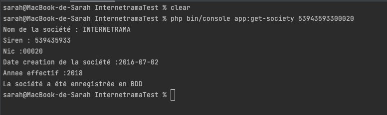

# Internetrama Test

  

Test technique : Créer une commande Symfony permettant de récupérer les données d'une société par le siret et d'enregistrer les données récupérées par cette API 

API Sirene V3

https://api.gouv.fr/les-api/sirene_v3

## Pour commencer

Lancer  `` composer install ``

Executez la commande ``php bin/console doctrine:database:create ``

Suivi de ``php bin/console make:migration ``

et de ``php bin/console doctrine:migrations:migrate ``

## GetSocietyBySiret

Executez la commande ``php bin/console app:get-society  {{siret}}``

`` {{siret}}`` == n° siret de la société recherchée (14 chiffres)
## Exemple de Résultat

